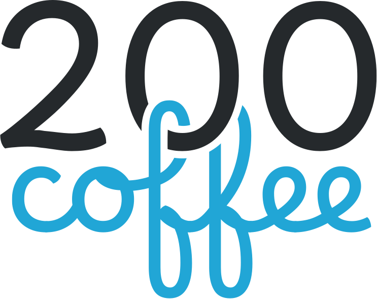
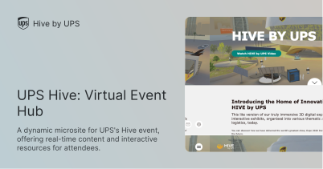
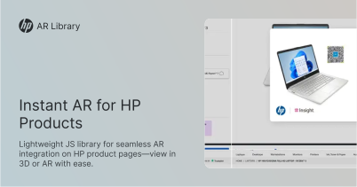
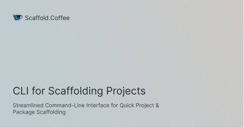
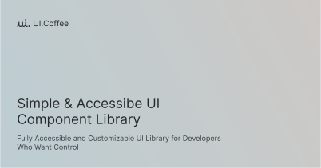
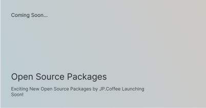
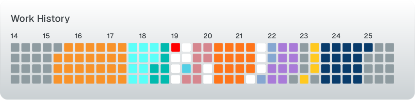

   <picture>
      <source media="(prefers-color-scheme: dark)" srcset="./assets/jp-coffee-branding-dark.svg" height="120" width="97">
      
   </picture>
   <picture>
      <source media="(prefers-color-scheme: dark)" srcset="https://img.icons8.com/ios-filled/50/ffffff/x.png" height="120" width="20">
      
   </picture>
   <picture>
      <source media="(prefers-color-scheme: dark)" srcset="./assets/200-coffee-branding-dark.svg" height="120" width="97">
      
   </picture>

<h3>
   Welcome! 
</h3>

Senior TypeScript Developer with 10 years of experience building scalable web applications. Skilled in React, Next.js, Node.js, Express.js, and HTMX, I specialize in creating high-performance front-end and back-end solutions. I’m passionate about open-source contributions and constantly improving my skills with the latest technologies and best practices. Let’s connect if you’re interested in collaborating on innovative projects or exploring new opportunities in web development.

---

### Some Projects I've Worked On 🚀

   <a
      href="https://jp.coffee"
      target="_blank"
      rel="noopener noreferrer"
      aria-expanded="false"
      aria-label="Link to JP.Coffee"
      title="JP.Coffee"
      style="text-decoration: none"
  >
      <picture>
         <source media="(prefers-color-scheme: dark)" srcset="./assets/projects/hive-by-ups-dark.svg" width="32%">
         
      </picture>
   </a>
   <a
    href="https://jp.coffee"
    target="_blank"
    rel="noopener noreferrer"
    aria-expanded="false"
    aria-label="Link to JP.Coffee"
    title="JP.Coffee"
    style="text-decoration: none"
  >
      <picture>
         <source media="(prefers-color-scheme: dark)" srcset="./assets/projects/hp-ar-library-dark.svg" width="32%">
         
      </picture>
   </a>
   <a
    href="https://jp.coffee"
    target="_blank"
    rel="noopener noreferrer"
    aria-expanded="false"
    aria-label="Link to JP.Coffee"
    title="JP.Coffee"
    style="text-decoration: none"
  >
      <picture>
         <source media="(prefers-color-scheme: dark)" srcset="./assets/projects/ultimaker-virtual-event-hub-dark.svg" width="32%">
         
      </picture>
   </a>

### My Open Source Packages 🌟

  <a
    href="https://github.com/200-coffee/scaffold.coffee"
    target="_blank"
    rel="noopener noreferrer"
    aria-expanded="false"
    aria-label="Link to JP.Coffee"
    title="JP.Coffee"
    style="text-decoration: none"
  >
    <picture>
      <source
         media="(prefers-color-scheme: dark)"
         srcset="./assets/packages/scaffold-coffee-dark.svg"
         width="32%"
      >
      
    </picture>
  </a>
  <a
    href="https://github.com/200-coffee/ui.coffee"
    target="_blank"
    rel="noopener noreferrer"
    aria-expanded="false"
    aria-label="Link to JP.Coffee"
    title="JP.Coffee"
    style="text-decoration: none"
   >
      <picture>
         <source
            media="(prefers-color-scheme: dark)"
            srcset="./assets/packages/ui-coffee-dark.svg"
            width="32%"
         >
         
      </picture>
   </a>
   <picture>
      <source
         media="(prefers-color-scheme: dark)"
         srcset="./assets/packages/coming-soon-dark.svg"
         width="32%"
      >
      
   </picture>  

---

### My Skills 🛠️

  
   
   
   
   
   
   
   
   
   
   
   
   
   
   
   
   
   
   
   
   
   
   
   
   
   

### Work History 📚

  <a
    href="https://jp.coffee"
    target="_blank"
    rel="noopener noreferrer"
    aria-expanded="false"
    aria-label="Link to JP.Coffee"
    title="JP.Coffee"
    style="text-decoration: none"
  >
    <picture>
      <source
         media="(prefers-color-scheme: dark)"
         srcset="./assets/work-history-dark.svg"
         width="100%"
      >
      
    </picture>
  </a>

### Let's Connect 🤝

  
   
   
</a>
