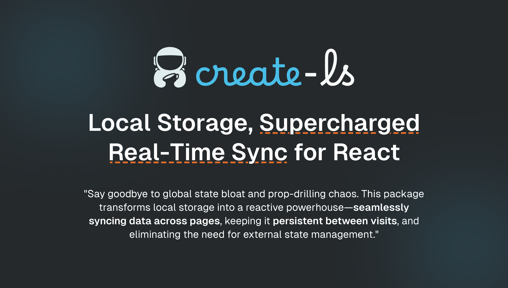

   <picture style="margin-right: 18px">
      <source media="(prefers-color-scheme: dark)" srcset="./assets/jp-coffee-spaceman-dark.svg" height="120" width="95.04">
      
   </picture>
   <picture>
      <source media="(prefers-color-scheme: dark)" srcset="./assets/jp-coffee-text-dark.svg" height="120" width="163">
      
   </picture>

<h3 align="center">🧠 Building useful things with TypeScript, React & a design-led mindset.</h3>

Hi, I'm James — a full-stack developer with 10+ years of experience designing and building modern web applications. I'm passionate about great developer experience, clean UI, and solving real-world problems with thoughtful code.

Most of my projects focus on SaaS platforms, internal tools, or open-source utilities that make dev life smoother. I enjoy working across the stack using **TypeScript**, **React**, **Node.js**, and a growing set of modern tools.

I occasionally write about dev workflows, tooling, and UI design at [jp.coffee](https://jp.coffee), and I maintain several open-source packages that power real projects.

> 💡 Always learning. Always building.

---

<h3 align="center">🌍 My Open Source Projects</h3>

Here are a few open-source packages and tools I maintain:

<a href="https://github.com/jp-coffee/create-ls">
   <picture>
      <source media="(prefers-color-scheme: dark)" srcset="./assets/open-source/create-ls-banner.png" style="max-width: 800px; width: 100%; display: block; margin: 0 auto;">
      
   </picture>
</a>

   <a href="https://github.com/jp-coffee/create-ls" style="margin-top: 6px">
      <picture>
         <source media="(prefers-color-scheme: dark)" srcset="https://img.shields.io/github/stars/jp-coffee/create-ls?style=flat&logo=github&labelColor=%23E3EEEE&color=%23E3EEEE&logoColor=25292C">
         
      </picture>
   </a>
   |
   <a href="https://npmjs.com/package/create-ls" style="margin-top: 6px">
      <picture>
         <source media="(prefers-color-scheme: dark)" srcset="https://img.shields.io/npm/v/create-ls?style=flat&logo=npm&labelColor=%23E3EEEE&color=%23E3EEEE&logoColor=25292C">
         
      </picture>
   </a>
   |
   <a href="https://github.com/jp-coffee/create-ls/issues" style="margin-top: 6px">
      <picture>
         <source media="(prefers-color-scheme: dark)" srcset="https://img.shields.io/github/issues/jp-coffee/create-ls?style=flat&logo=github&labelColor=%23E3EEEE&color=%23E3EEEE&logoColor=25292C">
         
      </picture>
   </a>

 

<a href="https://github.com/jp-coffee/hook-conditional">
   <picture>
      <source media="(prefers-color-scheme: dark)" srcset="./assets/open-source/hook-conditional-banner.png" style="max-width: 800px; width: 100%; display: block; margin: 0 auto;">
      
   </picture>
</a>

   <a href="https://github.com/jp-coffee/hook-conditional" style="margin-top: 6px">
      <picture>
         <source media="(prefers-color-scheme: dark)" srcset="https://img.shields.io/github/stars/jp-coffee/hook-conditional?style=flat&logo=github&labelColor=%23E3EEEE&color=%23E3EEEE&logoColor=25292C">
         
      </picture>
   </a>
   |
   <a href="https://npmjs.com/package/hook-conditional" style="margin-top: 6px">
      <picture>
         <source media="(prefers-color-scheme: dark)" srcset="https://img.shields.io/npm/v/hook-conditional?style=flat&logo=npm&labelColor=%23E3EEEE&color=%23E3EEEE&logoColor=25292C">
         
      </picture>
   </a>
   |
   <a href="https://github.com/jp-coffee/hook-conditional/issues" style="margin-top: 6px">
      <picture>
         <source media="(prefers-color-scheme: dark)" srcset="https://img.shields.io/github/issues/jp-coffee/hook-conditional?style=flat&logo=github&labelColor=%23E3EEEE&color=%23E3EEEE&logoColor=25292C">
         
      </picture>
   </a>

 

<a href="https://github.com/jp-coffee/create-cookie">
   <picture>
      <source media="(prefers-color-scheme: dark)" srcset="./assets/open-source/create-cookie-banner.png" style="max-width: 800px; width: 100%; display: block; margin: 0 auto;">
      
   </picture>
</a>

   <a href="https://github.com/jp-coffee/create-cookie" style="margin-top: 6px">
      <picture>
         <source media="(prefers-color-scheme: dark)" srcset="https://img.shields.io/github/stars/jp-coffee/create-cookie?style=flat&logo=github&labelColor=%23E3EEEE&color=%23E3EEEE&logoColor=25292C">
         
      </picture>
   </a>
   |
   <a href="https://npmjs.com/package/create-cookie" style="margin-top: 6px">
      <picture>
         <source media="(prefers-color-scheme: dark)" srcset="https://img.shields.io/npm/v/create-cookie?style=flat&logo=npm&labelColor=%23E3EEEE&color=%23E3EEEE&logoColor=25292C">
         
      </picture>
   </a>
   |
   <a href="https://github.com/jp-coffee/create-cookie/issues" style="margin-top: 6px">
      <picture>
         <source media="(prefers-color-scheme: dark)" srcset="https://img.shields.io/github/issues/jp-coffee/create-cookie?style=flat&logo=github&labelColor=%23E3EEEE&color=%23E3EEEE&logoColor=25292C">
         
      </picture>
   </a>

---

<h3 align="center">💻 My Current Tech Stack</h3>

Here are the technologies I'm currently using:

   
   
   
   
   
   
   
   
   
   
   
   
   
   
   
   
   

---

<!-- links/lets connect -->

<h3 align="center">🔗 Links & Let's Connect</h3>

Here are some ways to get in touch with me:

<!-- Website, LinkedIn, Daily.dev, GitHub, npm -->

   
   
   
   
   

